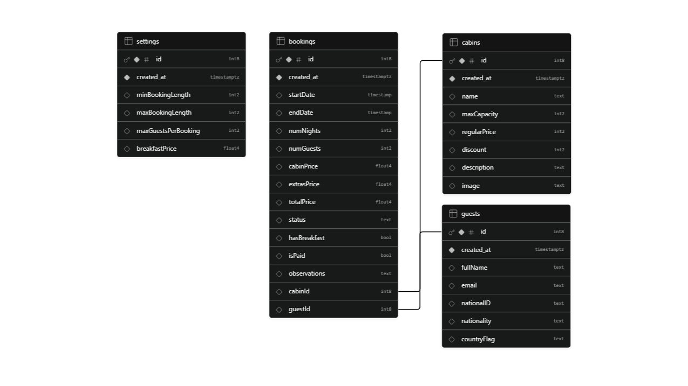

# 🌲 The Wild Oasis

<div align="center">

[](https://the-wild-oasis-omega-eosin-19.vercel.app/login)

<br />


</div>

> **💡 Test Credentials:** (To explore the dashboard)
> - **Email:** test@example.com
> - **Password:** 12345678

The Wild Oasis is a modern, full-stack single-page web application designed for internal hotel management and operations. It features a comprehensive statistics dashboard, secure staff authentication, advanced booking and cabin management, and real-time data mutations. Built with React, React Query, Styled Components, and Supabase.

## Key Features

* **Dynamic Dashboard:** Visualizes critical business metrics such as recent sales, check-ins, and cabin occupancy rates over various timeframes (7, 30, or 90 days) using interactive charts.
* **Secure Authentication:** Robust user authentication and authorization system for hotel staff, allowing secure sign-ins, profile updates, and avatar uploads.
* **Advanced Cabin Management:** Full CRUD capabilities for hotel cabins, including adding new cabins, updating details, duplicating existing entries, and uploading cabin images to remote storage.
* **Comprehensive Booking System:** Complete lifecycle management for guest bookings, featuring multi-criteria filtering, sorting, seamless check-in (with optional breakfast add-ons), and instant check-out workflows.
* **Global Settings Control:** Real-time updates for hotel-wide configurations, such as minimum/maximum booking nights, breakfast prices, and maximum guests per cabin.
* **Persistent Dark Mode:** Full UI dark/light mode toggle with state persistence across sessions for enhanced user experience.

## Database, Auth & Storage

Since this is a full-stack application, the backend infrastructure relies heavily on the Supabase ecosystem, utilizing its database, authentication, and storage solutions.

### 1. Database Schema (PostgreSQL)
The core application data is structured efficiently using Supabase PostgreSQL. Below is the Entity-Relationship Diagram (ERD) mapping the public tables: `bookings`, `cabins`, `guests`, and `settings`.



### 2. User Authentication (Supabase Auth)
Instead of a traditional public users table, staff members and user accounts are securely managed via **Supabase Auth**. Each authenticated user profile contains:
* **Email & Password:** For secure authentication and login.
* **Full Name:** For personalized dashboard experiences.
* **Avatar:** A profile picture linked to the user's account.

### 3. Media Storage (Supabase Buckets)
All media and image uploads are securely hosted and served via **Supabase Storage**. The application uses dedicated storage buckets for:
* **Cabins:** High-quality images for each cabin to be displayed in the UI.
* **Avatars:** Profile pictures uploaded and updated by the users.

## Architecture & Tech Stack

This project implements modern front-end architectures and robust state-management patterns:

* **React (Vite):** Powering a fast, highly-responsive Single-Page Application (SPA) architecture.
* **React Query (TanStack Query):** Handles remote state management, seamless data fetching, automatic caching, prefetching, and optimistic mutations for features like infinite scroll and pagination.
* **React Router:** Utilizes advanced declarative routing mechanisms for efficient application navigation.
* **Styled Components:** Implements component-scoped CSS-in-JS design system, facilitating clean, modular styling and native dark mode integration.
* **Supabase:** Serves as the real-time Backend-as-a-Service (BaaS), leveraging a PostgreSQL database, user authentication, and secure bucket storage for media uploads.
* **React Hook Form:** Manages complex form states, inputs, and client-side validation efficiently.
* **Recharts:** Renders responsive and interactive charts for the dashboard analytics.
* **React Hot Toast:** Provides elegant, non-intrusive toast notifications for user interactions.

## Folder Structure

The application is structured using a **Feature-Based Architecture**, ensuring high modularity, scalability, and separation of concerns.

```text
src/
├── context/        # React Context API providers (e.g., DarkModeContext)
├── features/       # Feature-specific components and hooks (Core business logic)
│   ├── authentication/
│   ├── bookings/
│   ├── cabins/
│   ├── check-in-out/
│   ├── dashboard/
│   └── settings/
├── hooks/          # Global custom React hooks (e.g., useMoveBack, useOutsideClick)
├── pages/          # Route components directly mapping to application pages
├── services/       # External APIs and Supabase client configurations
├── styles/         # Global styles and CSS variables
├── ui/             # Global, highly reusable UI components shared across the app
├── utils/          # Pure helper functions and constant variables (e.g., helpers, constants)
├── App.jsx         # Root component containing routing and global providers
└── main.jsx        # Application entry point
```
## Acknowledgements

Developed as the flagship project in **Jonas Schmedtmann's Ultimate React Course**, demonstrating advanced enterprise-grade React patterns, custom hooks, and full-stack integration.
